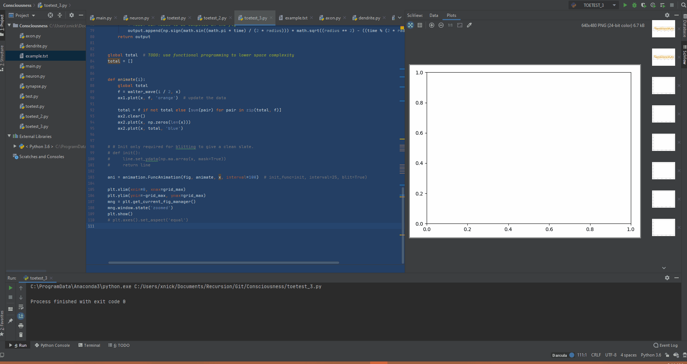

# secret-of-light
A code implementation of diagrams found in Walter Russell's book, The Secret of Light. 

### GIF of what I have so far
You can see from the *TODOs* in my code that I have not captured every element of the art provided by Walter, but I do have a working starting point. 

### Motivation
I found this periodic table to be very interesting because it *supposedly* generates atoms from very simple behavior. According to [Quora user Andrew Wolff, Adjunct Professor of Chemistry]https://www.quora.com/Why-was-Walter-Russells-version-of-the-periodic-table-not-adopted-by-chemists, *"The two periodic tables proposed by Walter Russell in 1926 show some remarkable insights and some incorrect predictions. The first iteration predicted a large number of elements before and after hydrogen that simply do not exist. It certainly does appear to predict elements past Uranium, and correctly leaves room for Technetium. Thus, the table had faults and insights. His second table avoids these faults while retaining the predictions of **then-unknown** elements."* I cannot find any evidence of someone trying to implement his art into code, so I decided to give it a shot. 

### Does Walter Russell's model of the atom disagree with Quantum Mechanics? 
To answer this, I first urge you to watch a video about the [Double Slit Experiment]https://youtu.be/h53PCmEMAGo, a video about the [Schrödinger equation]https://youtu.be/BPkcDWLBsrI, and a video about [Quantum Field Theory]https://youtu.be/MmG2ah5Df4g. Even if you're a Physicsist, I believe you will gain some valuable intuition about QM from these videos, please do watch them. [Dr. Jeroen Vleggaar]http://www.huygensoptics.com/contact_en.html, author of the double slit experiment video, summarizes my view of Quantum Mechanics very well: *"In a sense, quantum mechanics is not meant to make us understand the true nature of light and matter, **it was conceived to explain our observations and measurements**. From the perspective of the photon, as described by quantum mechanics, there is no such thing as a physical distance between possible states, because position is defined as a superposition of all possible states. And, In principle, the probability function can cover half the universe if the photon is allowed to travel a long time before absorption."* Use your own intuition here, do you think we need a different equation that describes electron orbitals? If you're a physicsist and you're not yet convinced, take a look at [Why Schrödinger equation is wrong?]http://www7b.biglobe.ne.jp/~kcy05t/schrodinger2.html

*"Different from actual multi-electron atoms (with electron's "orbit"), Schrodinger's wavefunction always spread all over the space. This property makes it impossible to solve Scchrodinger equation in multi-electron atoms."* So, to answer the original question, I don't know. We need to implement the model proposed by Walter, then try to add "measurements devices" to see if the observations of these generated atoms align with the probablity functions generated by the Schrödinger equation. 

### The first iteration of the periodic table as proposed by Walter Russell
<!---Walter Russell Periodic Table 1-->

### The second iteration of the periodic table
<!---Walter Russell Periodic Table 2-->

